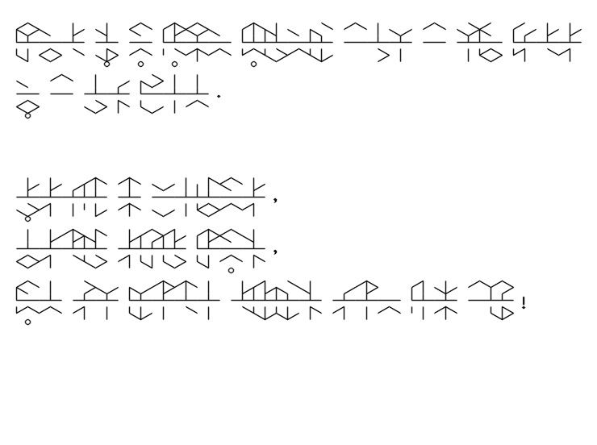

# Tunic Translator

本项目是一个用于将英语翻译为Tunic语言的工具。Tunic语言是游戏《[Tunic](https://store.steampowered.com/app/553420/TUNIC/)》中的符文文字。

在[Norgannon1028](https://github.com/Norgannon1028)的[原项目](https://github.com/Norgannon1028/TunicTranslator)的基础上进行了较多的修改。

A tool for translating English into Tunic language, which is a runic language in the video game [Tunic](https://store.steampowered.com/app/553420/TUNIC/).

Quite a lot of modifications are made based on the original [repository](https://github.com/Norgannon1028/TunicTranslator) of [Norgannon1028](https://github.com/Norgannon1028).

## 运行配置 / Requirements

- Python 3.9

  - numpy 1.20.3 
  - opencv 4.5.5.64
  - selenium 4.25.0

## 主要改动 / Changes

1. 不再通过`epitran`第三方库（需要本地安装`Flite`）进行音素转换，而是通过`selenium`模拟微软Edge浏览器向[网站](https://tophonetics.com/)查询。此外，移除了本地`Flask`服务器的相关功能。

- No longer rely on the third-party library `epitran` (which requires local installation of `Flite`). Instead, use `selenium` simulating a Microsoft Edge browser to query the [website](https://tophonetics.com/) for phonetic pronunciations. Besides, the local `Flask` server functionality is removed.

2. 新增了两个命令行参数，可以指定向网站查询时使用的口音（英式、美式），以及指定在画布上绘制文字时的整体比例大小（默认大小与原项目相同）。

- Add two new command-line arguments, which allow you to specify the accent used when querying the website (British or American), and specify the size multiplier when drawing the text on canvas (default size is the same as the original project).

3. 对文本编码完成后，将结果缓存在本地文件`encoding.cache`中。程序运行时每次优先从缓存文件中读取相同文本、相同口音下的文本编码结果，避免高耗时的网络查询。

- After encoding the text, the result is cached in the local file `encoding.cache`. The program reads from the cached result when encountering the same text and accent, as to avoid time-consuming online queries.

4. 更换了绘制标点符号时所使用的字体，使其更加美观。

- Change the font used for drawing punctuations for better looks.

5. 优化了对单个单词的音素拆分和识别，减少错误的音素，同时避免不合理的音节拆分，尽量减少元音前置音节的出现。

- Optimize the phonemic identification of a single word, reduce error phonemes, and avoid unreasonable syllable segmentation, as to minimize the appearance of vowel-initial syllables.

#### 单词举例 / Examples

- 以下为部分单词的拆分结果，原项目的结果在前，本项目的结果（使用美式英语口音）在后：

- The following are examples of words' phonemic segmentation, with the original project's results in the front, and this project's results (using American English accent) behind:

1. `fox`: `fɑr-k-s` vs `fɑ-k-s`
2. `reality` : `ri-æl-ət-i` vs `ri-æ-lə-ti`
3. `operate` : `ɑp-ər-eɪt` vs `ɑ-pə-reɪ-t`
4. `wanderer` : `wɑ-n-dər-ər` vs `wɑ-n-də-rər`

## 使用方法 / Usage

1. 在本项目根目录下，依次终端输入执行`conda create -p ./env python=3.9`创建虚拟环境，`conda activate ./env`激活虚拟环境，`pip install -r requirements.txt`安装依赖。

- Under the root directory of this project, first create a virtual environment by executing `conda create -p ./env python=3.9` in the terminal, then `conda activate ./env` to activate the virtual environment, and finally `pip install -r requirements.txt`.

2. 准备待翻译的文本文件，仅支持英文单词和标点符号`.,?!`。默认的输入文件为`input.txt`，内容如下：

- Prepare the input file you want to translate. Only English words and punctuations `,.?!` are supported. The translator takes `input.txt` by default. Let's take a look:

```
Tunic is an action adventure about a tiny fox in a big world.

Explore the wilderness,
discover spooky ruins,
and fight terrible creatures from long ago!
```

3. 在终端输入运行`python translator.py`即可。附加`-h`选项查看帮助：

- Simply run `python translator.py` in the terminal. Attach the `-h` option to check the usage of the script program:

```
usage: translator.py [-h] [-i <file>] [-o <file>] [-l <int>] [-c <int>] [-a <str>] [-m <int>]

optional arguments:
  -h, --help            show this help message and exit
  -i <file>, --input <file>
                        Read the input from <input_filename>, where the input should be English in plain text. (Default: "input.txt")
  -o <file>, --output <file>
                        Place the output into <output_filename>, where the output file format should be either jpg or png. (Default: "output.jpg")
  -l <int>, --line <int>
                        Set the number of lines (rows) in the canvas, affect the canvas height. (Default: 8)
  -c <int>, --char <int>
                        Set the number of characters (columns) per line, affect the canvas width. (Default: 25)
  -a <str>, --accent <str>
                        Set the accent of language pronunciation, either "en" or "us". (Default: us)
  -m <int>, --mul <int>
                        Set the size multiplier of the painted runes, affect the output picture size. (Default: 2)
```

4. 程序运行完成后，将结果保存在图片文件中。默认输入文件`input.txt`对应的输出文件`output.jpg`如下图：

- The script program generates the Tunic language translation and stores it as an image. With the default input `input.txt`, the output `output.jpg` looks like this:



## 参考资料 / Reference

感谢Reddit用户[oposdeo](https://www.reddit.com/user/oposdeo/)提供了Tunic语言的解码方法，并发布了[Tunic语言参考卡片](https://www.reddit.com/r/TunicGame/comments/tgc056/tunic_language_reference_sheet_big_spoiler/)。

另外也要感谢[旭日之记忆](https://space.bilibili.com/12994)提供的[Tunic语言视频教程](https://www.bilibili.com/video/BV1n541117Pi?share_source=copy_web)。

Huge credit goes to Reddit user [u/oposdeo](https://www.reddit.com/user/oposdeo/), who managed to decode the Tunic language, and the language reference sheet was posted [here](https://www.reddit.com/r/TunicGame/comments/tgc056/tunic_language_reference_sheet_big_spoiler/).

Also thanks for the Tunic language [video tutorial](https://www.bilibili.com/video/BV1n541117Pi?share_source=copy_web) given by [旭日之记忆](https://space.bilibili.com/12994).